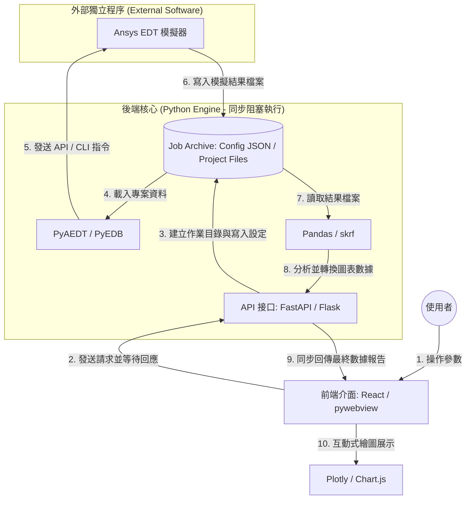
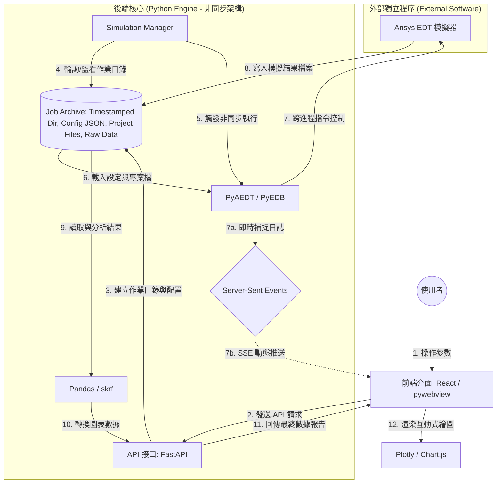

# 框架與軟體架構

這份文件聚焦於大型模擬自動化系統的框架設計、元件分工與軟體架構決策。注意本教學內容不涉及分佈式、多使用者、多服務場景。以單機獨立模擬安裝及授權，單使用者自動化場景為主。

### 大型模擬自動化的定義
有別於單純的腳本 (Scripts)，一個功能完善的自動化系統應具備：
- **互動式介面**: 提供 UI 讓用戶輸入參數、監控狀態，而非修改程式碼。
- **異步流程管理**: 模擬通常耗時長，系統需能處理長時間執行的任務且不導致 UI 凍結，並即時反應模擬進度。
- **數位資產管理**: 自動化提取數據、產出報告，並將結果結構化儲存。
- **可擴展服務化**: 將核心模擬能力封裝為可被前端與流程系統重複呼叫的服務。

### 系統架構圖
1. 物理/工程上的「同步」（Synchronization）定義：指的是「時間上對齊、同步步調」。例子：多個時鐘的時間調成一模一樣（時鐘同步）、水上芭蕾舞者在同一個秒數做出同一個動作、或是兩台伺服器裡的資料保持即時一致。核心概念：同時發生、保持步調一致。

2. 軟體設計上的「同步」（Synchronous, 簡寫 Sync）定義：指的是「順序性的執行，A 必須卡住等待 B 完成」。例子：同步（Sync）：你去櫃檯點餐，點完後你必須站在櫃檯前死等，直到店員把餐點做好交給你，你才能轉身離開去座位（A 等 B 做完，A 才能繼續）。

非同步（Async）：你去櫃檯點餐，店員給你一個「取餐呼叫器」。你立刻走回座位滑手機（A 繼續做自己的事）。等到呼叫器響了（B 完成了），你再去拿餐。

核心概念：依序發生、一條路走到底、會產生阻塞（Blocking）。

#### 同步架構圖

#### 異步架構圖

## 1. 後端邏輯：模擬任務與資料處理
這是自動化的核心，負責執行模擬動作並提取數位資產。

### 核心模擬庫：PyEDB / PyAEDT
- **Layout 自動化**: 使用 PyEDB 進行 PCB/Package 堆疊與元件配置。
- **模擬流程控制**: 使用 PyAEDT 啟動 HFSS/SIwave/Circuit，執行掃描與分析。
- **物件導向設計**: 封裝常用的模擬樣板 (Template)，提高程式碼重用率。

### 資料科學工具箱
- **Numpy**: 數值矩陣處理運算。
- **Pandas**: 處理大規模模擬結果 (Sweeps) 的二維表格資料。
- **Matplotlib / Seaborn**: 生成工程品質的靜態圖表與 PDF 報告。
- **Scikit-rf (skrf)**: 專業處理 S 參數 (Touchstone 檔案) 的級聯、去嵌入 (De-embedding) 與網路分析。

## 2. 後端服務：網路 API 化
將封閉的模擬腳本轉化為可由前端或 RPA 呼叫的微服務。

### FastAPI
- **非同步支援**: 處理耗時的模擬請求而不阻塞主線程。
- **即時通訊 (WebSockets/SSE)**: 實現模擬進度的實時推送，讓前端動態顯示後端日誌。
- **自動化文件**: 自動產生 Swagger UI (OpenAPI)，方便開發者測試。
- **Pydantic**: 資料驗證，確保輸入的模擬參數格式正確。

### 動態訊息輸出機制 (Real-time Logging)
在執行 PyAEDT/PyEDB 時，必須解決「漫長等待」中的焦慮，機制如下：
1. **客製化 Logging Handler**: 在 Python 邏輯中攔截 PyAEDT 的訊息（如 `oDesktop.AddMessage`）。
2. **生產者-消費者模型**: 使用 `asyncio.Queue` 暫存產出的 Log 訊息。
3. **推播服務**: FastAPI 透過 WebSocket 或 Server-Sent Events (SSE) 將隊列中的內容持續推送至前端。
4. **前端展示**: React 監聽訊號，實時將訊息 Append 到「訊息視窗 (Log Console)」。

### Uvicorn
- 高性能的 ASGI（Asynchronous Server Gateway Interface，非同步伺服器閘道介面）伺服器，負責執行 FastAPI 應用。

## 3. 後端核心實作策略：腳本優先與進程隔離
針對 PyAEDT/PyEDB 這種重量級模擬任務，建議採用「腳本優先，服務封裝」 (Script-First, Service-Encapsulation) 的設計模式。

### 核心理念
- **腳本獨立運作**：先以 AI Agent 構建具備完整功能的獨立 Python 腳本 (Standalone Scripts)，模擬工程師可在本地直接執行與除錯。
- **進程隔離 (Process Isolation)**：FastAPI 不直接調用模擬函式庫，而是透過 `asyncio.create_subprocess_exec` 以 `popen` 模式調動外部進程執行腳本。

### 為什麼這是一個好的 Design Pattern？
1. **穩定性 (Fault Tolerance)**：Ansys AEDT 的 COM/gRPC 接口若發生崩潰，僅會影響該腳本進程，不會波及 API 伺服器主進程。
2. **AI Agent 親和力**：模型在生成單一功能的腳本（輸入/輸出定義清晰）時準確率最高，有利於快速迭代模擬邏輯。
3. **異步日誌流 (Real-time Feedback)**：利用 `popen` 讀取 `stdout.readline` 並配合 `yield` 傳送 SSE，可讓用戶在網頁上看到秒級更新的模擬日誌。
4. **環境管理一致性**：配合 `uv run` 呼叫腳本，確保每個任務都在其定義的虛擬環境中執行。

### 作業(Job)目錄
每一次發起的模擬都用time-stamped目錄儲存輸入輸出，並作為工作目錄。

## 4. 前端開發：現代化使用者介面
將複雜的參數輸入與結果展示「視覺化」與「簡單化」。

### React + TypeScript
- **組件式開發 (Component-based)**: 將 UI 拆分為選單、圖表、進度條。
- **TypeScript**: 提供強型別檢查，減少前端邏輯錯誤。
- **State Management**: 控制模擬任務的狀態同步 (Idle, Running, Finished)。

### 互動式圖表：Plotly
- **Web 端互動**: 在瀏覽器中進行 Zoom-in/out、查看曲線數據點。
- **S 參數展示**: 生成動態的 Insertion Loss / Return Loss 圖表。
- **3D 視覺化**: 展示電磁場分佈或結構幾何。

### 布局與規劃
- **導覽列 (Navigation/Menu)**: 切換不同的模擬任務（如 S 參數提取、熱分析、DRC 檢查）。
- **參數面板 (Control Panel)**: 使用表單輸入尺寸、頻率範圍、材料屬性。
- **訊息視窗 (Log Console)**: 實時顯示後端模擬進度與報錯訊息。
- **繪圖畫布 (Canvas/Chart)**: 顯示 Plotly 的交互式曲線或 3D 幾何預覽。
- **任務清單 (Task List)**: 紀錄歷史模擬任務及其成功/失敗狀態。

### 桌面應用程式整合：pywebview
- **輕量化外殼**: 將 React 前端包裝成視窗程式，不需開啟瀏覽器即可運行。
- **後端整合**: 讓 Python 直接控制視窗行為，適合分發給不熟悉網頁的操作員。

| 特性 (Feature) | 網頁瀏覽器 (Web Browser) | Pywebview (桌面整合) |
| :--- | :--- | :--- |
| **檔案系統存取** | 嚴格受限 (Sandbox 限制)，僅能透過上傳/下載 | **完全存取**，Python 可直接讀寫本地檔案路徑 |
| **啟動與加載** | 需依賴網頁伺服器狀態，受網路延遲影響 | **啟動極快**，本地靜態資源直接加載 |
| **系統底層整合** | 較低，無法直接調用作業系統 API | **極高**，可控制視窗狀態、整合本地硬體 |
| **使用者介面** | 受限於瀏覽器 UI (有分頁、網址列) | **獨立應用程式感**，Native Look & Feel |
| **安全與隱私** | 資料需上傳至伺服器處理 | 資料可完全留在本地端執行，安全性高 |

### 為何不使用tkinter, QT等傳統介面
雖然 Tkinter、PyQt/PySide (Qt) 等傳統桌面 GUI 框架是可行的選項，但本架構選擇基於 Web 技術的方案（React + pywebview），主要考量如下：

*   **現代化的使用者體驗 (Modern UI/UX)**：Web 技術 (HTML, CSS, JavaScript) 在打造美觀、響應式且具互動性的介面上擁有無可比擬的優勢。藉助 React、Vue 等前端框架及其豐富的生態系（如 Ant Design, Material-UI），開發者可以更快速地建構出專業且符合現代審美標準的介面，而傳統 GUI 框架的樣式客製化通常更為繁瑣。

*   **強大的資料視覺化整合**：模擬自動化工具的核心之一是數據呈現。諸如 `Plotly.js`, `ECharts`, `D3.js` 等頂尖的互動式圖表庫原生於 Web 環境。將它們整合進 React 前端是無縫的，可以輕鬆實現數據的縮放、拖曳、點擊提示等豐富的互動功能，這在 Qt 或 Tkinter 中實現起來相對困難。

*   **跨平台與遠端存取能力**：
    *   **原生跨平台**：Web UI 只要有瀏覽器就能運行，無需針對 Windows, macOS, Linux 分別打包和測試。
    *   **易於遠端化**：此架構可輕易部署在遠端伺服器上，使用者僅需透過瀏覽器即可存取，無需安裝任何客戶端軟體。這對於昂貴的模擬運算資源集中管理的場景至關重要。

*   **開發者生態與人才庫**：前端開發社群極為龐大，擁有海量的開源函式庫、工具和解決方案，遇到問題時更容易找到支援。相比之下，專精於 Python 結合 Qt/Tkinter 的開發者較少，長期維護和功能擴展可能面臨挑戰。

*   **前後端分離的清晰架構**：採用 React (前端) 和 FastAPI (後端 API) 的模式，強制性地分離了 UI 呈現和核心業務邏輯。這種清晰的邊界使得團隊可以並行開發，也讓系統的測試、維護和未來擴展（例如，增加新的前端 App 或開放 API 給其他服務使用）變得更加簡單。

總結來說，選擇 Web 技術不僅是為了打造一個更好看的介面，更是為了擁抱一個更現代、更靈活、更具擴展性的開發模式，確保專案的長期生命力。

